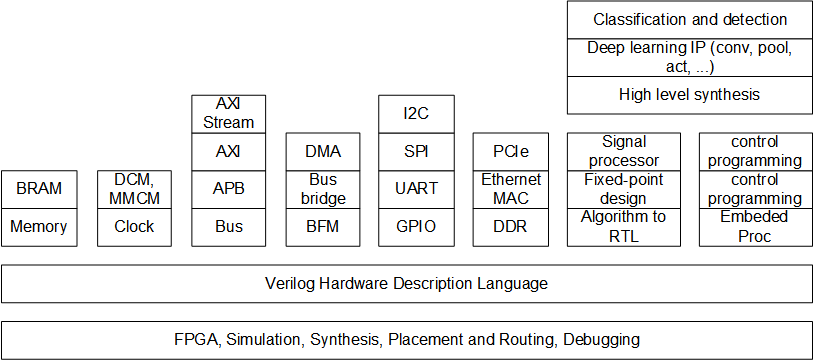

# Engineering Program on RTL Design for FPGA Accelerator
This material is for those who are interested in developing RTL design for FPGA.

## License
Most of the contents are prepared by Dr. Ando Ki (andoki@gmail.com) and some of it has been collected from open source domain.
So you are welcome to use it without any restrictions, but be noted that there is no support or warranty and can use it at your own risk.

Any material or subjects protected by intellectual property right, each contributor holds copyright over their respective contributions.

## Required environment
It is assumed that you have followings.

1. Ubuntu 16 or 18 on Intel-processor PC
2. Xilinx Vivado WebPack installed (no license required)
3. Avent ZedBoard
4. Future Design Systems CON-FMC

**Vivado WebPack** is a license-free Vivado software package from Xilinx for synthesis and analysis of HDL designs,
More details can be found at <a href="https://www.xilinx.com/products/design-tools/vivado/vivado-webpack.html" target="_blank">here</a>.

**ZedBoard** is a low-cost development board for the Xilinx Zynq-7000 FPGA.
More details can be found at <a href="http://zedboard.org/content/overview" target="_blank">here</a>.

**CON-FMC** is an FMC (FPGA Mezzanine Card) and connects computer to the FPGA through USB 3.0/2.0. 
More details can be found at <a href="http://www.future-ds.com/en/products.html#CON_FMC" target="_blank">here</a>
and <a href="https://github.com/github-fds/confmc.x86_64.linux.2020.06" target="_blank">here</a>.

## Contents
It is subject to change without notice.

### 1.  <a href="session_01_simple_memory/README.md"      >session_01_simple_memory</a>
Covers how to use Verilog task to test block.
### 2.  <a href="session_02_bram_memory/README.md"        >session_02_bram_memory  </a>
Covers how to use Xilinx built-in block memory
### 3.  <a href="session_03_clock/README.md"              >session_03_clock        </a>
Covers how to use clock manager
### 4.  <a href="session_04_verilog/README.md"            >session_04_verilog      </a>
Covers general and details of Verilog
### 5.  <a href="session_05_bus/README.md"                >session_05_bus          </a>
Covers system bus in general
### 6.  <a href="session_06_amba_apb/README.md"           >session_06_amba_apb     </a>
Covers AMBA APB and memory block with APB interface
### 7.  <a href="session_07_gpio_apb/README.md"           >session_07_gpio_apb     </a>
Covers GPIO with APB interface
### 8.  <a href="session_08_amba_axi/README.md"           >session_08_amba_axi     </a>
Covers AMBA AXI bus and memory with AXI interface
### 9.  <a href="session_09_dma_axi/README.md"            >session_09_dma_axi      </a>
Covers DMA with AXI interface
### 10. <a href="session_10_tea/README.md"                >session_10_tea          </a>
Covers how to develop RTL from C-level algorithm using Tiny Encryption Standard
### 11. <a href="session_11_fixed_point/README.md"        >session_11_fixed_point  </a>
Covers how to develop fixed-point from floating-point
### 12. <a href="session_12_high_level_synthesis/README.md">session_12_high_level_synthesis  </a>
Covers how to use HLS
### 13. <a href="session_13_convolution/README.md"        >session_13_convolution  </a>
Covers 2D convolution for deep learning application
### 14. <a href="session_14_pooling/README.md"            >session_14_pooling      </a>
Covers pooling for deep learning application
### 15. <a href="session_15_activation/README.md"         >session_15_activation   </a>
Covers activation functions for deep learning application
### 16. <a href="session_16_i2c/README.md"                >session_16_i2c          </a>
Covers I2C controller
### 17. <a href="session_17_spi/README.md"                >session_17_spi          </a>
Covers SPI controller
### 18. <a href="session_18_uart/README.md"               >session_18_uart         </a>
Covers UART
### 19. <a href="session_19_memory_interface/README.md"   >session_19_memory_interface</a>
Covers DDR memory interface
### 20. <a href="session_20_ethernet_mac/README.md"       >session_20_ethernet mac</a>
Covers Gigabit Ethernet MAC
### 21. <a href="session_21_pci_express/README.md"        >session_21_pci_express</a>
Covers PCI-Express

## Contact
* <a href="http://www.future-ds.com" target="_blank">**Future Design Systems**</a>
* **[contact@future-ds.com](mailto:contact@future-ds.com)**
